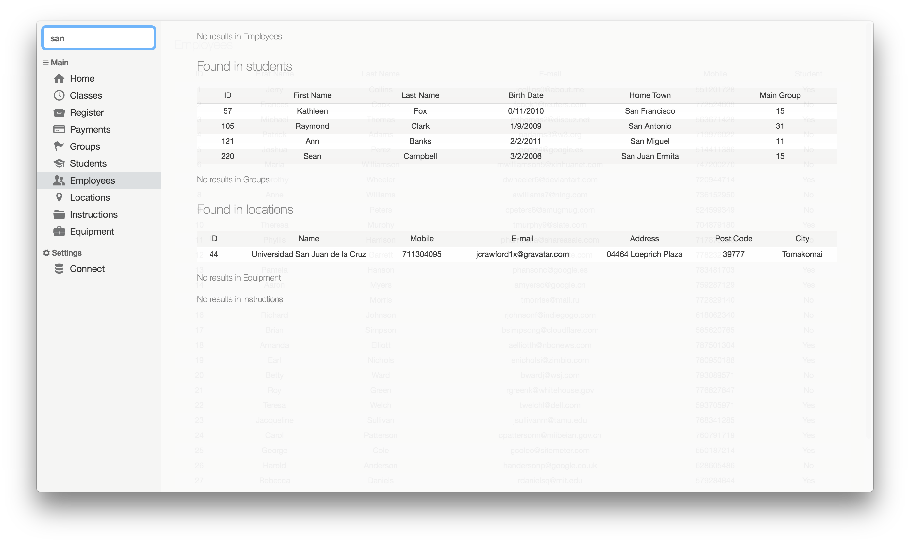

# Databases


## About the project

This project was built on node.js and following modules:

- electron
- mysql
- photon

## Whats included

```
database/
└── dump.sql
app/
├── assets/
│   ├── css/
│   │   ├── info.css
│   │   ├── login.css
│   │   ├── search.css
│   │   └── section.css
│   ├── imports.js
│   └── nav.js
├── renderer-process/
│   ├── classes.js
│   ├── employee-info.js
│   ├── employees.js
│   ├── equipment.js
│   ├── group-info.js
│   ├── groups.js
│   ├── home.js
│   ├── instruction-info.js
│   ├── instructions.js
│   ├── location-info.js
│   ├── locations.js
│   ├── login.js
│   ├── payments.js
│   ├── register-info.js
│   ├── register.js
│   ├── search.js
│   ├── student-info.js
│   └── students.js
├── sections/
│   ├── classes.html
│   ├── employee-info.html
│   ├── employees.html
│   ├── equipment.html
│   ├── group-info.html
│   ├── groups.html
│   ├── home.html
│   ├── instruction-info.html
│   ├── instructions.html
│   ├── location-info.html
│   ├── locations.html
│   ├── login.html
│   ├── payments.html
│   ├── register-info.html
│   ├── register.html
│   ├── search.html
│   ├── student-info.html
│   └── students.html
├── index.html
├── index.js
├── main.js
└── package.json
```

Note: few functionalities are not implemented yet, so few files may be empty (payments.js I'm looking at you) and buttons in the home page are not working.

## Usage

First create new database on your local mysql server and import the dump files from 'database' folder
```
mysqladmin -u <username> -p create <databasename>
mysql -u <username> -p <databasename> < <filename.sql>
```

Then go into the 'app' folder and install node dependencies and run the app
```
npm install
npm start
```

The app will launch and you will be welcomed with login screen. Enter login info and have fun.

Note: due to The Asynchronous Nature of JavaScript, you will not login correctly at the beginning, please go into the menu and select 'Connect' and now you will be good to go.

## Final project requirements:

- [x] `table count: - 15(+-5)`
- [x] `joins: left, inner, right, union - 5`
- [x] `select, insert, delete, update - ?`
- [ ] `transactions - 5 `
- [ ] `procedures - 2`
- [ ] `functions - 2`
- [x] `full-text search - 1`
- [x] `triggers - 2`
- [x] `views - 2`
- [ ] `aggregation functions - 3`
- [x] `constraints: unique, foreign - 5`
- [x] `subqueries - 2`
- [ ] `like - 2`
- [x] `between - 2`
- [x] `order - 4`
