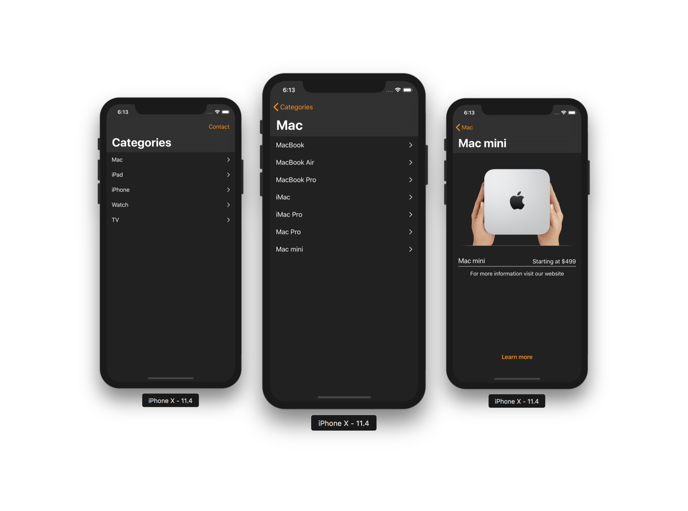

# Advanced Graphical Interfaces (Summer 2018)

<p align=center>
<a href="">

</a>
</p>
<p align=center>
<a href="https://developer.apple.com/xcode/">

</a>
<a href="https://swift.org">

</a>
<a href="https://developer.apple.com/ios/">

</a>
</p>

## Assingments

#### Paper

> "Developing Apps for iOS" [Polish]

- [`developing-apps-for-ios-pl.tex`](developing-apps-for-ios-pl.tex)

Compile using lualatex
```shell
$ lualatex --interaction=batchmode developing-apps-for-ios-pl.tex 
```

or simply open included PDF file
- [`developing-apps-for-ios-pl.pdf`](developing-apps-for-ios-pl.pdf)

#### Demo iOS Applicaiton

- [`AppleStore`](AppleStore)

To install dependencies run
```shell
$ pod install
```
