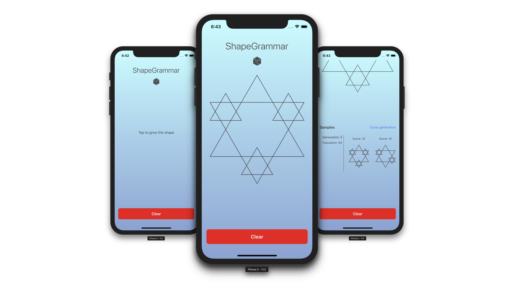

# Computer Supported Design (Winter 2017)

## Assignments

Solutions for the assignments below are implemented in the ShapeGrammar iOS app. I have tried to extract the implementation of each task to separate file/class, so all the other I won't mention other files here - only the ones containing the essential logic.

- [x] 1. Shape grammar

	Create interface for generating and displaying simple shapes using the grammar defined.
	- ShapeGrammar App [`Xcode project`](ShapeGrammar/)

- [x] 2. Preference function

	Implement a function that will generate a random shape using your grammar. Next add function that will evaluate generated shape and give it a score depending on preferences.
	- ShapeGradingHelper [`swift`](ShapeGrammar/ShapeGrammar/Utils/ShapeGradingHelper.swift)

- [x] 3. Evolutionary algorithm

	An algorithm that will generate a number of sample shapes, and with the help of preference function will pick only those with the highest score to crossbreed a new generations of shapes.
	- ShapeCrossbreedingHelper [`swift`](ShapeGrammar/ShapeGrammar/Utils/ShapeCrossbreedingHelper.swift)
