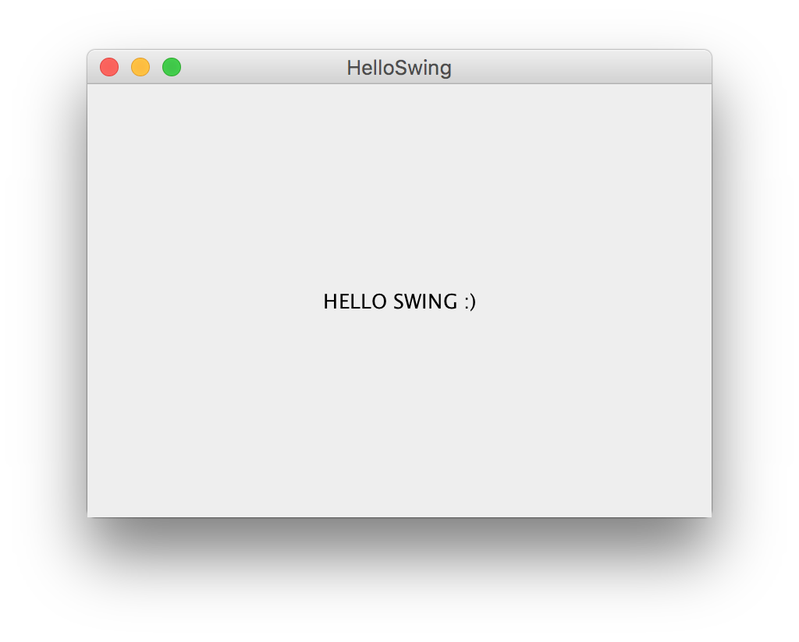

# Zestaw 1



## Introduction

Simple HelloWorld assignment.

## What's included

```
hello/
├── HelloApplet.html
├── HelloApplet.java
├── HelloFX.java
├── HelloStatic.java
├── HelloSwing.java
├── PrintFromFile.java
└── input.txt
```

## Usage

Compile and run

```
javac HelloFX.java
java HelloFX
```
