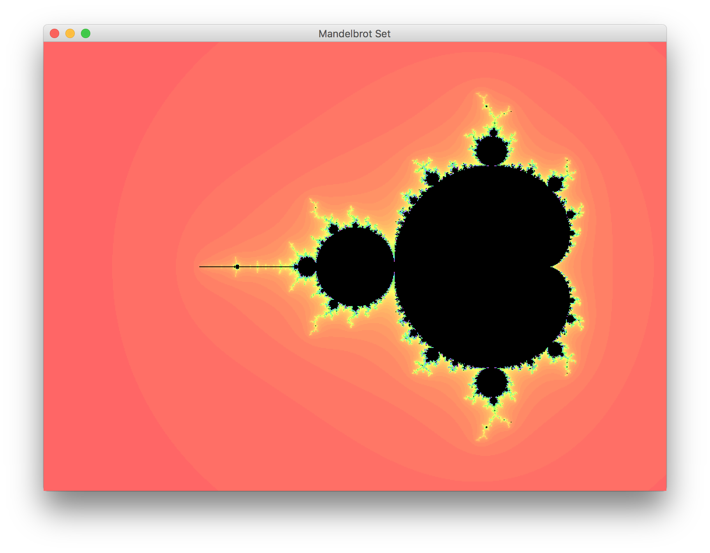

# Assignment 3



## Mandelbrot

This task was about drawing Mandelbrot set using Complex.class from previous task. Mandelbrot.class draws the set and displays GUI.

## What's included

```
mandelbrot/
├── Complex.java
└── Mandelbrot.java
```

## Usage

Compile and run

```
javac mandelbrot/*.java
java mandelbrot.Mandelbrot
```
