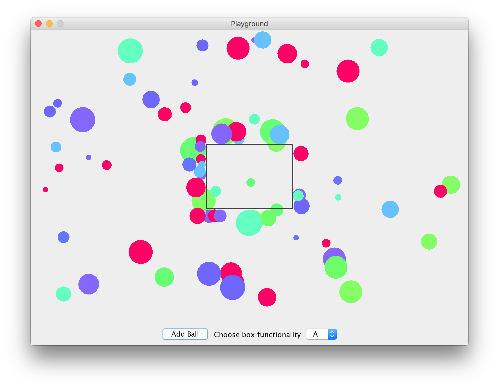

# Assignment 4



## Threads

This time we had to write Bouncing Balls program using threads with synchronization. I wrote Ball.class that extends JComponent and implements Runnable, so each ball can be a different thread. Then I created another class called Box.class that draws a box inside a Playground.class. Playground.class itself is a class with main() that handles and displays all balls that are added manually by the user. Ball are synchronized the way that one will not enter the box while another is inside, so it will stick to the box and wait. Other options of synchronization are not implemented.

## What's included

```
balls/
├── Ball.java
├── Box.java
└── Playground.java
```

## Usage

Compile and run

```
javac balls/*.java
java balls.Playground
```
