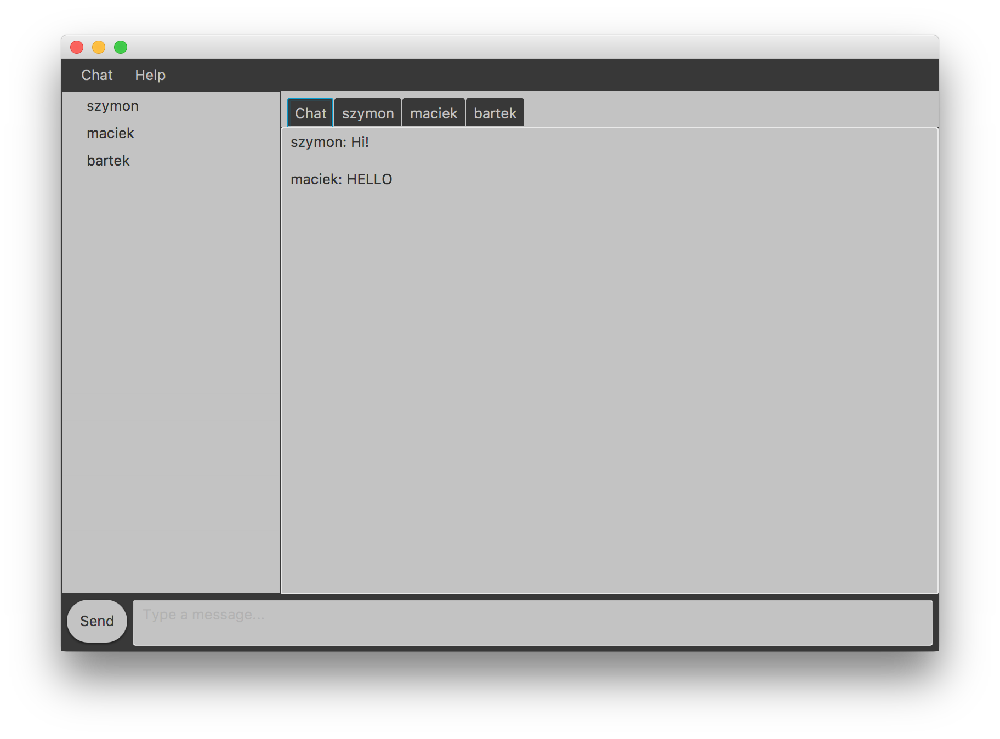

# Assignment 7



credit: Client made by @vyzyv

## Project: Instant Messenger

This is a final project I did with @vyzyv

My part was to code fully functioning server that supports public chat for all online users, and private messaging between users that know each others usernames. The server is multithreaded and creates new thread for each user that logs in. It stores the information of every registered user as long as its (the server) online. One cool feature is that while one user is offline, and other one messages him, all the messages will be stored by server and sent to him as soon as he logs in. Messaging is handled by ObjectStreams that are sending and receiving Message.class objects which are storing information of sender, recipient, and message content. The messages will be never sent to the wrong user, since server reads the recipient username and checks if he is logged in, if he is (the socket thread is alive) id sends the message, if not (socked thread is not alive) it stores the message in an array assigned to the recipient. Server logs any activity on the terminal. The Client on my side is very primitive, but it's purpose was for testing only, but its working tho. The server has implemented serialization of user database but for some reason, I was not using it. Tumple.class is here to support less awkward user information storage.

## What's included

```
chat/
├── Client.java
├── Message.java
├── Server.java
└── Tuple.java
```

## Usage

Compile and run

```
javac chat/*.java
java chat.Server
java chat.Client
```
