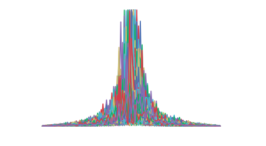

# Statistical Methods (Winter 2017)

## About

In this class I was assigned with multiple statistical exercises. Most of them are required and some are optional. The outline can be found in the section below.

## Assignments

[R] - required, [O] - optional

#### Gambler's ruin problem

Solutions [`jupyter notebook`](gamblers-ruin-problem.ipynb)

- [x] 1. [R]
- [x] 2. [R]
- [x] 3. [R]
- [x] 4. [R]
- [x] 5. [O]
- [x] 6. [R]
- [x] 7. [R]
- [x] 8. [O]

#### Markov processes

Solutions [`jupyter notebook`](markov-processes.ipynb)

- [x] 9. [R]
- [ ] 10. [O]

#### Poisson point process

Solutions [`jupyter notebook`](poisson-processes.ipynb)

- [x] 11. [R]
- [ ] 12. [O]

#### Queueing Processes

- [ ] 13. [R]
- [ ] 14. [O]
